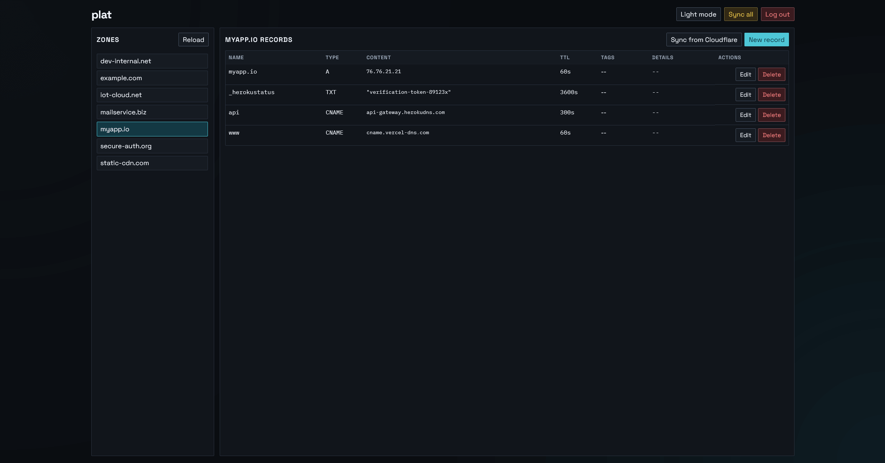
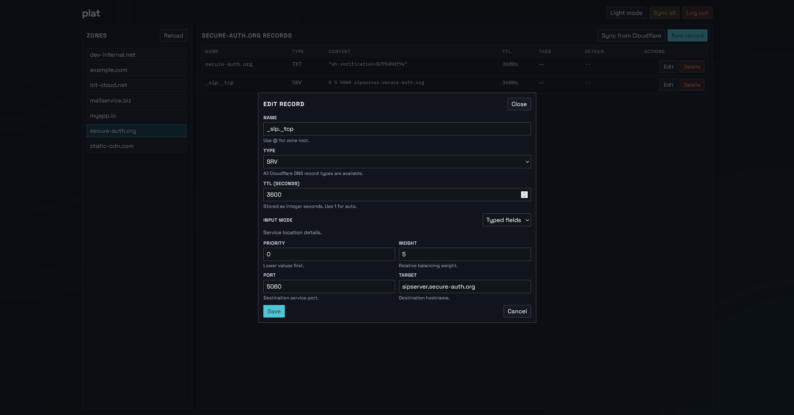
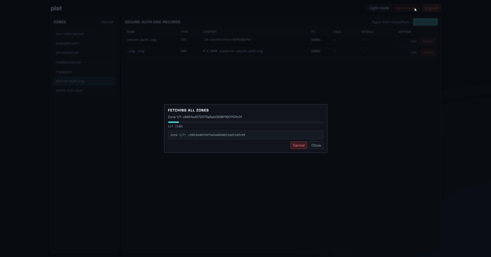

# plat

`plat` is a local-first DNS manager for Cloudflare. It keeps your own copy of records in `records.yml`, gives you a faster UI for day-to-day edits and lets you sync with Cloudflare when needed. The name is from cadastral plats: clear maps of boundaries and lots; here, the same idea is applied to DNS zones and records.

## Installation

Download a pre-built release from the [releases page](https://github.com/coalaura/plat/releases/latest).


*Browse zones and records in one view.*


*Edit records with typed fields for Cloudflare record types.*


*Run full sync with progress and logs.*

## Configuration

`config.yml` is created automatically on first run with defaults.

```yml
# enable verbose logging and diagnostics
debug: false

server:
  # port to run plat on (default: 8080)
  port: 8080
  # token for authentication, (default: "p4$$w0rd")
  token: p4$$w0rd

cloudflare:
  # cloudflare api token (default: "")
  token: ""

dns:
  # enable built-in dns server (default: true)
  enabled: true
  # dns server port (default: 531)
  port: 531
  # optional fallback resolver for unknown queries (default: "9.9.9.9")
  fallback: 9.9.9.9
```

## License

GPL-3.0 (see `LICENSE`).
